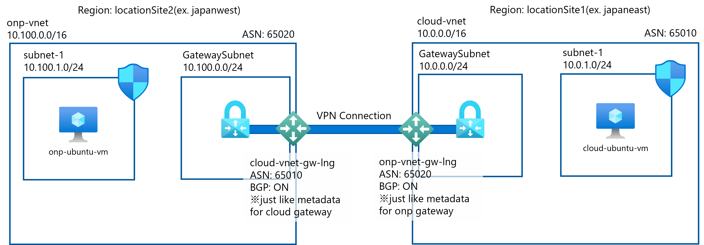

# bicep-s2svpn-bgp
This bicep file deploys resources for S2S VPN between VNets enabling BGP.

The architecture image is bellow:


# How to use
Create `params.json` to deploy resources. Please refer [params-sample.json](./params-sample.json)

Next create the resource group for this depoloyment.

```
$ az group create --name MyResourceGroup --location japaneast
```
You can choose the both onp location and cloud location for testing `cross-regional S2SVPN with BGP` senario.

Deploy main.bicep options:

- With parameter file

```
$ az deployment group create --resource-group MyResourceGroup --template-file main.bicep --parameters params.json
```

- Without parameter file

This option, you have to fill the parameters in the prompt.

```
$ az deployment group create --resource-group MyResourceGroup --template-file main.bicep

locationSite1: xxxx
locationSite2: xxxx
vmAdminUserName: xxxx
vmAdminPassword: xxxx
principalId: xxxx
```

# Notes
If you want to try ping test between onp-vm and cloud-vm, you need to access either vm. So you must create public ip resource and attach it to the nic. After connect the vm, try ping.
```
azureuser@vm-ubuntu-onp$ ping 10.0.1.4
PING 10.0.1.4 (10.0.1.4) 56(84) bytes of data.
64 bytes from 10.0.1.4: icmp_seq=1 ttl=64 time=12.7 ms
64 bytes from 10.0.1.4: icmp_seq=2 ttl=64 time=12.1 ms
64 bytes from 10.0.1.4: icmp_seq=3 ttl=64 time=12.1 ms
```
- As you can see effective routes, the VM recieves the routes for the peer VNet.
 

## For more information
Please refer this article.

https://zenn.dev/microsoft/articles/8d1558a8a2127c